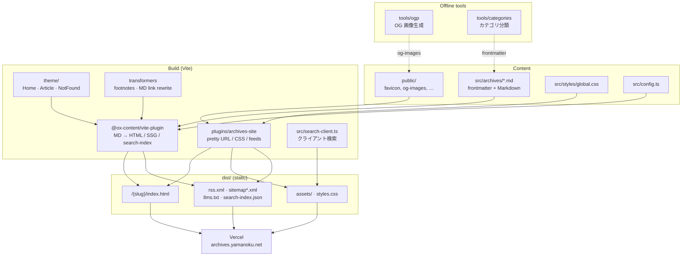

# [archives.yamanoku.net](https://archives.yamanoku.net/)

[yamanoku](https://github.com/yamanoku) archive contents. (Japanese text only)

## Architecture

Markdown 記事を Vite + [@ox-content/vite-plugin](https://github.com/ox-content/ox-content) で静的サイトにビルドし、Vercel へ配信する構成。



| レイヤ | 役割 |
| --- | --- |
| `src/archives/` | 記事本体（Markdown） |
| `theme/` | ページレイアウトと共通コンポーネント |
| `plugins/` | ox-content 設定・脚注・フィード・ビルド後処理 |
| `tools/` | OG 画像生成・カテゴリ分類（ビルド外） |
| `dist/` | 静的成果物（Vercel へデプロイ） |

## Build Setup

```bash
# install dependencies
$ npm ci

# setup serve
$ npm run dev

# generate static project
$ npm run build
```
