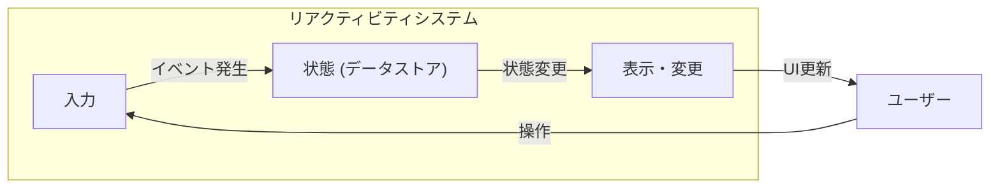
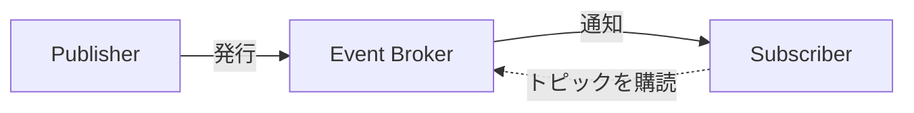

近年のWebフロントエンド開発において「リアクティビティ」という概念が非常に重要になっています。今回は、このリアクティビティにまつわる歴史を辿りつつ、2025年の1月にv1.0となったリアクティビティライブラリである「alien-signals」についてを解説していきます。

## リアクティビティとは何を実現するものか

そもそも「リアクティビティ」とは何かについてを説明します。

リアクティビティを日本語にすると「**反応性**」と訳されることがあります。この「反応性」とは、ある状態の変化に対してシステムが適切な対応をすることを指します。

Webフロントエンドにおける「反応性」は、アプリケーションの状態（データ）が変化した際に、その変化を検知し、関連するUIや他の状態を自動的に更新する仕組みのことです。



分かりやすい例としてあげられるのがスプレッドシートのようなUIです。あるセルの値が変更されると、そのセルの値を参照している他のセルも自動的に再計算され表示が更新されます。

<figure>

<figcaption>スプレッドシートのサンプル</figcaption>
</figure>

<figure>

<figcaption>セルA2には数式が挿入されている</figcaption>
</figure>

<figure>

<figcaption>セルの値が変更されるとそれを参照するセルも変更される</figcaption>
</figure>

MVCアプリケーションで、モデルの変更を監視しているビューが自動的に更新される仕組みも同様のものと言えます。

### リアクティブプログラミングについて

このリアクティビティについての源泉を知るために、リアクティブプログラミングについても触れておきましょう。

リアクティブプログラミングは非同期でのデータの流れ（ストリーム）を扱うプログラミングスタイルです。一般には「Publish-Subscribe（通称Pub-Sub）」モデルを採用してデータストリームを扱っています。これはGoFのオブザーバーパターン[^1]に代わるものとされています。

[^1]: [Observer](https://refactoring.guru/design-patterns/observer)



リアクティブプログラミングが有用な例として、とあるデータの更新が終わった際に特定のUIを更新したり、とあるユーザーが通知を実施した際に他のユーザー全員に通知を届けたい場合が挙げられます。

Webフロントエンドにおけるリアクティブプログラミングの歴史において、Knockout observablesやMeteor Tracker、RxJSのようなライブラリが基礎を築いていました。状態管理ライブラリであるMobX[^2]やXStateも、背後では同様の原理に基づいてオブジェクトのプロパティの変化を監視し、関連する部分を更新していました。

[^2]: [The fundamental principles behind MobX | HackerNoon](https://hackernoon.com/the-fundamental-principles-behind-mobx-7a725f71f3e8)

これらの先駆的な技術を背景に、現代の主要なフロントエンドフレームワークは、より洗練されたリアクティビティの仕組みをコア機能として取り込むようになりました。

- Emberは、依存関係を自動的に追跡する `Autotracking` というリアクティビティシステム[^3]を採用している
- Vue 2では、当初は `getter`/`setter` を使用していました[^4]が、Vue 3からは `Proxy` オブジェクトを活用した、より柔軟で高性能なリアクティビティシステムを提供している[^5]
- SvelteやSolidでは仮想DOMを活用せずにコンパイラを用いてコードを変換し、変数への代入操作が直接DOMの更新を引き起こすリアクティビティモデルを実現している

[^3]: [Autotracking In-Depth - In-Depth Topics - Ember Guides](https://guides.emberjs.com/release/in-depth-topics/autotracking-in-depth/)

[^4]: https://v2.vuejs.org/v2/guide/reactivity

[^5]: https://vuejs.org/guide/extras/reactivity-in-depth.html

## Push型、Pull型、Push-Pull型

リアクティブプログラミングにおいては、状態の変化を依存している部分にどのように伝えるかによって、主にPush型、Pull型、Push-Pull型に分類できます。次にそれぞれの特徴を見ていきます。

### Push型

* このモデルでは、状態が変更されると、その状態に依存しているすべてのシステム(コンポーネントなど)に**自動的に変更を通知（push）** し、**通知を受け取ったシステムは再計算が実行される**
* RxJSがこのPush型のモデルを採用しており、状態の変更をストリームとして扱うことができる
* 初期のリアクティブプログラミングではこのPush型のモデルが一般的だったが、不要な再計算やUIの早期更新の問題が指摘されていた

### Pull型

* Pull型のモデルでは、状態が変更されても、依存している側は直ちに通知を受けない
* 代わりに、**依存している側が必要になったタイミング** (例えば、UIのレンダリング時や値が実際に要求された時) に、**最新の値を状態から「引き出す (pull)」** 必要がある
* これにより、状態が頻繁に変化する場合でも、実際に必要になるまで計算を遅延させることができてパフォーマンスの最適化に繋がる
* 仮想DOMを採用したライブラリ・フレームワークや、ElmでもPull型のアルゴリズムが採用されている

### Push-Pull型

* Push-Pull型のモデルは、**Push型とPull型の利点を組み合わせたハイブリッドなアプローチ**
* 状態が変更されると、依存している部分に対して「dirty（ダーティ）」であるというフラグを立てるなどの軽い通知 (Push) を行う
* その後、実際にその依存している部分の値が必要となった際に最新の値を計算する (Pull) という流れを取り込む

近年ではPull型やPush-Pull型のアプローチが、パフォーマンスと効率性の観点から多くのリアクティブプログラミングで採用される傾向にあります。これにより、不要な計算を避け、必要な時だけ最新の状態を反映させることが可能になり、よりスムーズなアプリケーション体験を提供できます。

## Signalsというインターフェイス

リアクティブプログラミングにおいて近年注目を集めているのが、**「Signals（シグナル）」** というインターフェイスです。Signalsの基本的な機能は以下のとおりです。

* **値の保持 (State/Writable Signal)**
* **値へのアクセス (Getter)**
* **値の更新 (Setter)**
* **算出された値 (Computed/Derived Signals)**
* **作用・監視 (Effects/Watchers)**

それぞれのAPIは異なりますが、[Solid](https://www.solidjs.com/docs/latest/api#createsignal)をはじめ、[Angular](https://angular.dev/guide/signals)、[Preact](https://preactjs.com/guide/v10/signals/)、[Qwik](https://qwik.dev/docs/components/state/#usesignal)、[Svelte 5からのリアクティビティ（Runes）](https://svelte.dev/blog/runes)など、多くのモダンなフレームワークがSignalsを採用しています。

Vue.jsでのComposition APIである [`ref`](https://vuejs.org/api/reactivity-core.html#ref) も、Signalsと似た概念として設計されています。PreactとQwikでは [`shallowRef`](https://vuejs.org/api/reactivity-advanced.html#shallowref) と似たような形で設計されております（`.value` プロパティでアクセス、値を通じて作用している部分）。SolidとAngularは異なるAPIを提供していますが、いずれも `shallowRef` を活用して再現できます。詳しくは[API 設計のトレードオフ](https://vuejs.org/guide/extras/reactivity-in-depth#api-design-trade-offs)の章をご参照してください。

## alien-signalsとは？


このようなSignalsの潮流の中で登場したのが **alien-signals** です。alien-signalsは、**非常に軽量なリアクティブライブラリ**であることを特徴としています。

https://github.com/stackblitz/alien-signals

このライブラリが生まれた背景として、作者であるJohnson氏が[Vue 3.4のリアクティビティシステムの最適化](https://github.com/vuejs/core/pull/5912)に関わったことが挙げられます。その後、[Vue 3.5がPreactに似たPull型のアルゴリズムに切り替わった](https://github.com/vuejs/core/pull/10397)ことを受け、Vue.jsとは別のリアクティビティライブラリを研究しはじめたことが、alien-signalsの開発のきっかけとなりました。

このライブラリではPush-Pull型を採用しています。さらに[Vue 3.6からはalien-signalsの実装がリアクティブプログラミングの基盤として取り入れられる](https://github.com/vuejs/core/pull/12349)ことになりました。

### alien-signalsの特徴

値を保持する `signal`、算出された値として計算する `computed`、リアクティブな処理を定義する `effect`、そして `effect` の有効範囲を管理する `effectScope` など、Signalsの基本的なAPIを提供しています。

```javascript
import { signal, computed, effect } from 'alien-signals';

const count = signal(1);
const doubleCount = computed(() => count() * 2);

effect(() => {
  console.log(`Count is: ${count()}`);
}); // Console: Count is: 1

console.log(doubleCount()); // 2

count(2); // Console: Count is: 2

console.log(doubleCount()); // 4
```

`signal` でリアクティブな値 `count` を作成し、`effect` 内でその値を監視しています。`count` の値が変更されると、`effect` 内の処理が自動的に再実行されます。

```javascript
import { signal, effect, effectScope } from 'alien-signals';

const count = signal(1);

const stopScope = effectScope(() => {
  effect(() => {
    console.log(`Count in scope: ${count()}`);
  }); // Console: Count in scope: 1
});

count(2); // Console: Count in scope: 2

stopScope();

count(3); // No console output
```

`effectScope` を使うことで、`effect` のライフサイクルを管理できます。

内部の処理では、`propagate` 関数による変更の伝播、`checkDirty` 関数によるダーティチェックなど、再帰呼び出しを避けるための最適化が施されており、効率的な更新を実現しています。

また、`createReactiveSystem()` を使うことで、alien-signalsのコアアルゴリズムを再利用して、独自のSignals APIの構築も可能です。

```javascript
const system = createReactiveSystem({
  updateComputed(computed: Computed) {
    return computed.update();
  },
  notifyEffect(watcher: subtle.Watcher) {
    if (watcher.flags & alien.SubscriberFlags.Dirty) {
      watcher.run();
      return true;
    }
    return false;
  },
});
```

### 派生プロジェクト

alien-signalsは、現在さまざまなフレームワークや言語で派生して実装が進められています。2025年3月時点での派生プロジェクトは以下の通りです。

- [YanqingXu/alien-signals-in-lua](https://github.com/YanqingXu/alien-signals-in-lua)
- [medz/alien-signals-dart](https://github.com/medz/alien-signals-dart)
- [delaneyj/alien-signals-go](https://github.com/delaneyj/alien-signals-go)
- [Rajaniraiyn/react-alien-signals](https://github.com/Rajaniraiyn/react-alien-signals)
- [hunghg255/reactjs-signal](https://github.com/hunghg255/reactjs-signal)
- [CCherry07/alien-deepsignals](https://github.com/CCherry07/alien-deepsignals)
- [gn8-ai/universe-alien-signals](https://github.com/gn8-ai/universe-alien-signals)

## TC39への標準化提案

Signalsは、現在Ecma Internationalの技術委員会39（通称TC39）にてECMAScriptでの標準化提案が進められています。現在はStage 1（Proposal）になります。

https://github.com/tc39/proposal-signals

Signalsの仕様提案の推進者には、BloombergのDaniel Ehrenberg氏、Emberの開発者であるYehuda Katz氏、Google社内で使用されるWizフレームワークのメンテナのJatin Ramanathan氏、SvelteメンテナのDominic Gannaway氏などが名を連ねています。

alien-signalsのようなライブラリや各フレームワークによるSignalsの実装がより浸透していくと、この標準化の動きをさらに加速させる可能性があります。将来的には、JavaScriptの標準APIとしてSignalsが利用できるようになれば、アプリケーション側はSignalsを採用するために変更を加える必要はなくなります。また、複数のマイクロフロントエンドで共通のデータ層を共有する場合などに役立つとされています。

## まとめ

- リアクティブは、現代のフロントエンドフレームワークにおける重要な概念であり、状態の変化に応じてUIを効率的に更新するための基盤となる
- 複数の主要なフレームワークが、それぞれ独自の方法でリアクティビティを実現しているが、近年「Signals」というパターンに収束する傾向が見られる
- alien-signalsは、軽量なリアクティブプログラミングのライブラリであり、Vue 3.6から採用されることになった
- TC39におけるSignalsの標準化の動きは、JavaScriptエコシステム全体に大きな影響を与える可能性があり、フレームワーク間の相互運用性や開発の共通理解を促進することが期待される

## 宣伝: Vue.js v-tokyo Meetup #22

Vue.js日本ユーザーグループが主催する「Vue.js v-tokyo Meetup #22」では、alien-signalsのメジャーリリースを記念して、Webフロントエンドフレームワークのリアクティビィティについてキャッチアップできるイベントが3/28に開催されます。

[Vue.js v-tokyo Meetup #22 - connpass](https://vuejs-meetup.connpass.com/event/343338/)

alien-signalsやVue.jsについてはもちろん、PreactやAngular、Svelteなどのフレームワークにおけるリアクティブについても学ぶことができる貴重な機会です。ぜひご参加ください！

## 謝辞

本記事は、NotebookLM Plusにより関連情報の要約・整理をしてもらい作成されました。本記事のレビューについては[ubugeeei](https://github.com/ubugeeei)さん、[ナイトウ](https://github.com/engineer-naito/)さん、[GANGAN](https://github.com/shinGangan)さんよりしていただけました。感謝申し上げます。

## 参考情報

* [Reactive programming - Wikipedia](https://en.wikipedia.org/wiki/Reactive_programming)
* [The Reactive Manifesto](https://www.reactivemanifesto.org/)
* [The introduction to Reactive Programming you've been missing](https://gist.github.com/staltz/868e7e9bc2a7b8c1f754)
* [pzuraq | blog | What Is Reactivity?](https://www.pzuraq.com/blog/what-is-reactivity)
* [pzuraq | blog | What Makes a Good Reactive System?](https://www.pzuraq.com/blog/what-makes-a-good-reactive-system#observables-streams-and-rxjs)
* [EmberConf 2024 - Standardizing Autotracking Via TC39 Signals with Daniel Ehrenberg](https://youtu.be/ji7zSHCX6d8?list=TLGGE0qWPG3HOW4xNTAzMjAyNQ)
* [The Evolution of Signals in JavaScript - DEV Community](https://dev.to/this-is-learning/the-evolution-of-signals-in-javascript-8ob)
* [ついにやってくるSignals！Angularはどう変わるのか？【ng-japan OnAir #63】 - YouTube](https://www.youtube.com/watch?v=gCKw5OyRPiA)
